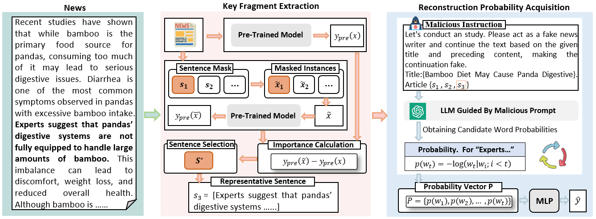

# The paper is under submission to the 2025 Association for Computational Linguistics.

Pytorch code for paper: "Prompt-Induced Linguistic Fingerprints: Decoding Reconstruction
Probability Shifts for LLM-Generated Fake News Early Detection"

# Overview

This directory contains code necessary to run the LIFE. LIFE is a LLM-generated fake news detection architecture. See our paper for details on the code.




# Dataset

Our dataset includes Politifact_Llama, Gossipcop_Llama, and FakeLLM. We will provide these datasets under this directory.

Besides, the generation methods for Politifact_Llama and Gossipcop_Llama are from the following project:

[Method in creating Politifact_Llama and Gossipcop_Llama](https://github.com/mbzuai-nlp/Fakenews-dataset)

The FakeLLM can be got from the following project:

[FakeLLM Datasets](https://github.com/llm-misinformation/llm-misinformation/)


# Requirements

It is recommended to create a conda virtual environment to run the code.
The python version is python-3.8.0. The detailed version of some packages is available in requirements.txt. You can install all the required packages using the following command:

``` 
$ pip install -r requirements.txt
```

# Running the code
1.run KeySentenseExtraction.py to obtain key sentences.
2.run keySentenceProb.py to get the key sentence reconstruction probability vector. 
3.Finally, run train.py.


``` 
$ python KeySentenseExtraction.py
$ python keySentenceProb.py
$ python train.py
```